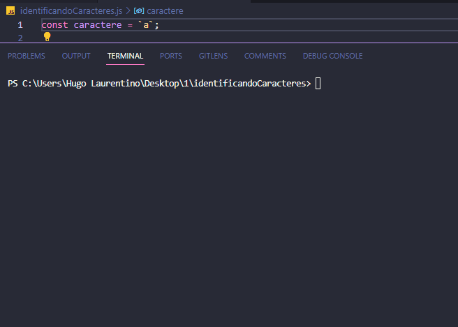

<h1 align="center">
  
</h1>

- [x] Bak-End
- [x] Criar Título
- [x] Criar Descrição
- [x] Sobre
- [x] Tecnologia
- [x] Pre requisito
- [x] Autor
- [x] GIF‘s

---
<h1 align='center'>Identificando Caracteres</h1>

<p align='center'>Esse é um exemplo de lógica em javascript</p>
<p align='center'>
Seu programa deverá dizer qual a categoria do caractere. Caso a categoria seja **Vogal**, seu programa deverá ainda informar se a vogal é maiúscula ou minúscula.
</p>

<p align='center'>
 <a href='#sobre'>Sobre</a> |
 <a href='#pré-requisitos'>Pre Requisitos</a> |
 <a href='#tecnologias'>Tecnologias</a> |
 <a href='#autor'>Autor</a>
</p>

---
<h1 align='center'>
 
</h1>

---

### Sobre

  <p align= 'justify'>
    Faça um programa que identifica caracteres. Seu programa deverá classificar este único caractere, que estará guardado numa variável, em uma das categorias abaixo:

| Categoria | Caractere                             |
| --------- | ------------------------------------- |
| Vogal     | A E I O U a e i o u                   |
| Consoante | Qualquer letra que não seja uma vogal |
| Número    | 1 2 3 4 5 6 7 9 0                     |
  </p>

---

### Pré-requisitos

Antes de começar, você vai precisar ter instalado em sua máquina as seguintes FERRAMENTAS: [GIT](https://git-scm.com/), [Node.js](https://nodejs.org/en/download).
Além disto é bom ter um editor para trabalhar com o código como [VSCode](https://code.visualstudio.com/download).

### 🎲 Rodando o Back End

```bash
# Clone este repositório
$ git clone https://github.com/hugolaurentino/identificandoCaracteres.git

# Acesse a pasta do projeto no terminal/cmd
$ cd identificandoCaracteres

# Instale as dependências
$ npm install

# Execute 
$ node .\identificandoCaracteres.js

```
### Tecnologias

As seguintes ferramentas foram usadas na construção do projeto:

- [Node.js][nodejs]

---
###### tags: `lógica` `matemática` `nodeJS`
## Autor
Feito com ❤️ por Hugo Laurentino 👋🏽 [Entre em contato!](https://www.linkedin.com/in/hugo-laurentino-silva/)

[nodejs]: https://nodejs.org/
